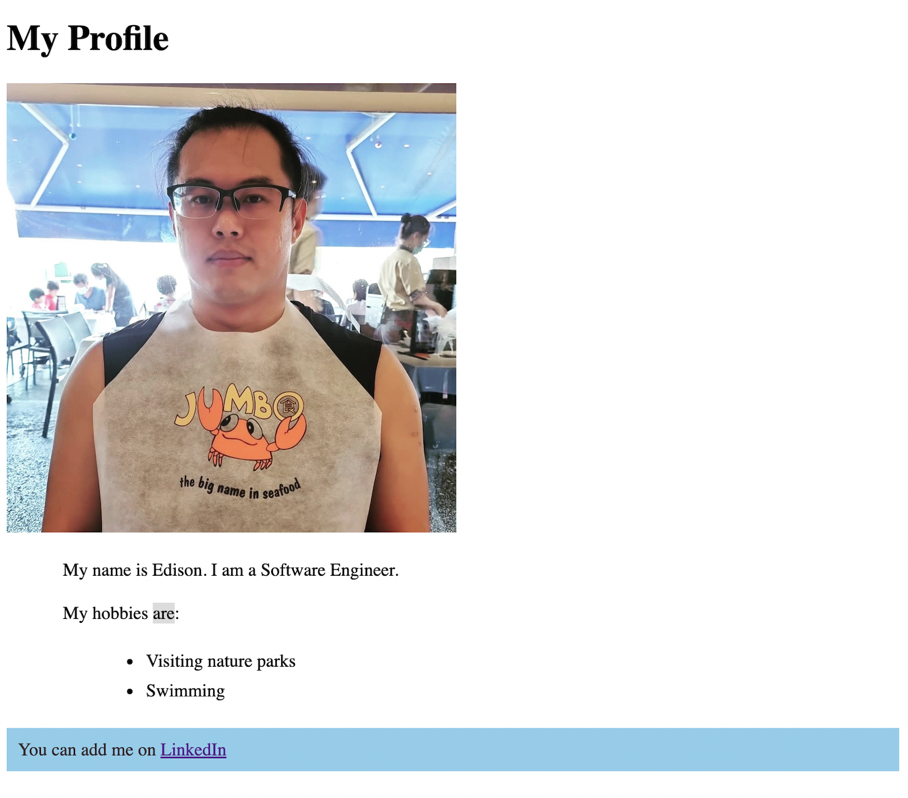
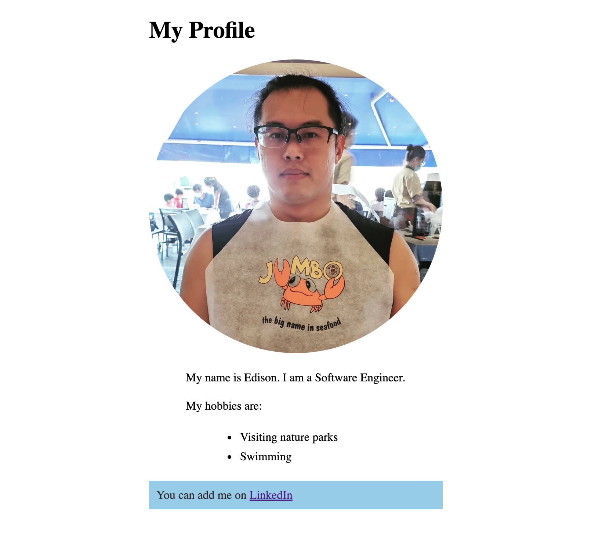

# Homework

## Brief

Firstly, import the codes written during the lesson into the [homework folder](./src/homework).

There are two challenges:

1. Make avatar profile rounded using CSS
1. Centralized all elements instead of the default being left-aligned

Before:

After:

## Submission

- You should `fork` and `clone` the lesson repository
- Commit and push code to your repository
- Submit your GitHub URL to LMS

END