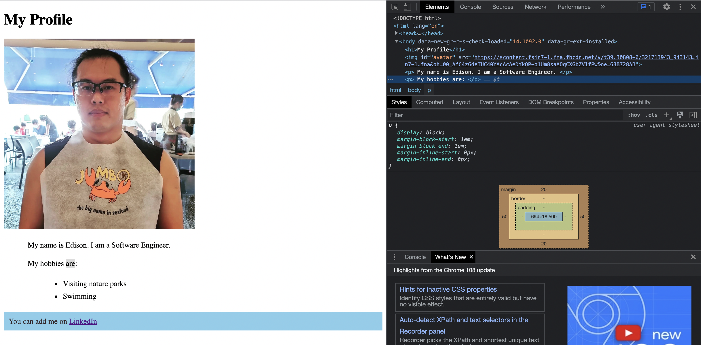

# Lesson

## Lesson Overview

This lesson aims to kickstart learners in the use of VS Code and creating a simple profile using HTML and CSS. There are so many HTML Tags and CSS Styles that it is impossible to memorize. Therefore, instructor should constantly reference cheatsheets or online resources while walking through this lesson. It helps reinforce "not memorizing" and "teach a man to fish" ideas.

---

## Part 1 - Create a simple profile page with HTML

### End of Lesson Goal Demo

Let's have a look on the end-product of this lesson. Right-click on `./src/lesson/index.html` file and select `Open with Live Server`. The browser should display the webpage. Otherwise, manually enter the URL http://127.0.0.1:5500/html-and-css/src/lesson/index.html (or click this link) on the browser.

### Launch & Explore VS Code

**Launch VS Code**

Steps: 

1. Create a new folder anywhere in your local machine
1. Open that folder in VS Code
    - Option 1: On Terminal, use `code <folder name>` command
    - Option 2: Launch VS Code > Click on "File" on menu bar > Click on "Open Folder..."
1. Create a new file call `index.html`
1. Right-click `index.html` and click on `Open with Live Server`


**VS Code Overview**


- The red square and font is where the Terminal located
- The green space is the file explorer based on the folder you open / launch vs code in
- The blue space is the editor where you make changes to files


### HTML Code Walkthrough

Instructor to code along with learners and implement the following code in `index.html`:

> Reference [cheatsheet](https://htmlcheatsheet.com/) as we go along

```html
<!DOCTYPE html>
<html lang="en">
<head>
    <meta charset="UTF-8">
    <meta http-equiv="X-UA-Compatible" content="IE=edge">
    <meta name="viewport" content="width=device-width, initial-scale=1.0">
    <title>My Profile</title>
    <link rel="stylesheet" type="text/css" href="styles.css">
</head>
<body>
    <h1>My Profile</h1>
    
    <p>
        My name is Edison. I am a Software Engineer.
    </p>
    <p>
        My hobbies are:
        <ul>
            <li>Visiting nature parks</li>
            <li>Swimming</li>
        </ul>
    </p>
    <div class="social">
        You can add me on <a href="enter an url of your social media page">LinkedIn</a>
    </div>
</body>
</html>
```

> Tips: type `html` and an autocomplete option will appear. Choose `html:5` to populate a html template.

Instructor should walk through the code by explaining:
- What are `<html>`, `<head>`, and `<body>`
- The `<title>` and `<link>` tags within the `<head>`
- All HTML Tags withiin `<body>`

Learners should have a good overview from [pre-lesson work](./pre-lesson-work.md).

---

## Part 2 - Insert CSS Styling

### CSS Code Walkthrough

Steps:
1. Create a new file `styles.css` that is to be imported by `<link>` tag in `index.html`
1. Instructor to code along with learners and implement the following code in `styles.css`:

> Reference [cheatsheet](https://htmlcheatsheet.com/) as we go along

```css
#avatar {
    width:400px;
}

p {
    margin:20px 50px 20px 50px;
}

ul {
    margin-left:80px;
}

li {
    padding:4px;
}

.social {
    background-color:skyblue;
    color:#34282C;
    padding:10px;
}
```

### Use Developer's Tool

Steps:

1. Right-click on webpage > Click on "Inspect"
1. Explore the tab "Elements" tab
1. Observe the box model 



---

## Part 3 - Practice

The goal of this practice should guide learners to:

1. Use cheatsheet or reference online to further develop the profile page with more HTML Tags and CSS Properties
2. Get familiarize with HTML and CSS
3. Trial and error, and resolve errors

END